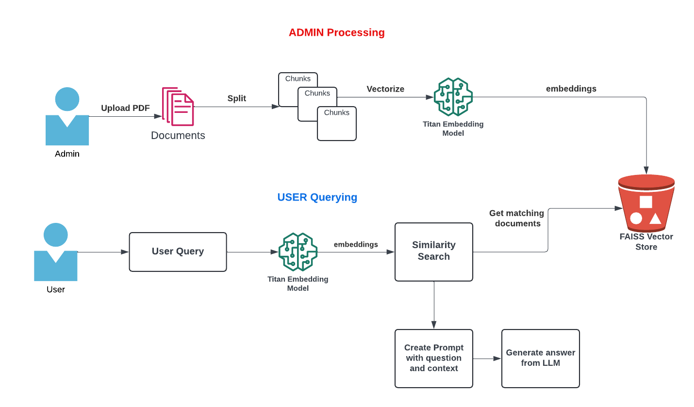

# Chat With PDF - Generative AI Application
## Built Using Amazon Bedrock, Langchain, Python, Docker, Amazon S3
## Models used:
    Amazon Titan Embedding G1 - Text
    Anthropic Claude 2.1

## Introduction
In this video we will build a CHATBOT like application with AWS Amazon Bedrock, docker, python, Langchain, and Streamlit. We will use Retrieval-Augmented generation concept to provide context to the Large Language model along with user query to generate response from our Knowledgebase.

In this hands-on tutorial, we will demonstrate the following:
- Architecture of the applications
- Build 2 applications (ADMIN and USER) and create DOCKER images

## Architecture

## ADMIN Application:
    - Build Admin Web application where AdminUser can upload the pdf.
    - The PDF text is split into chunks
    - Using the Amazon Titan Embedding Model, create the vector representation of the chunks
    - Using FAISS, save the vector index locally
    - Upload the index to Amazon S3 bucket (You can use other vector stores like OpenSearch, Pinecone, PgVector etc., but for this demo, I chose cost effective S3)

### Docker Commands:

  Build Docker Image:
  `docker build -t pdf-reader-admin .`

  Run ADMIN application:
  `docker run -e BUCKET_NAME=<YOUR S3 BUCKET NAME> -v ~/.aws:/root/.aws -p 8083:8083 -it pdf-reader-admin`

## USER Application:
  - Build User Web application where users can query / chat with the pdf.
  - At the application start, download the index files from S3 to build local FAISS index (vector store)
  - Langchain's RetrievalQA, does the following:
     - Convert the User's query to vector embedding using Amazon Titan Embedding Model (Make sure to use the same model that was used for creating the chunk's embedding on the Admin side)
    - Do similarity search to the FAISS index and retrieve 5 relevant documents pertaining to the user query to build the context
    - Using Prompt template, provide the question and context to the Large Language Model. We are using Claude model from Anthropic.
   -  Display the LLM's response to the user.

### Docker Commands:

  Build Docker Image:
  `docker build -t pdf-reader-client .`

  Run ADMIN application:
  `docker run -e BUCKET_NAME=<YOUR S3 BUCKET NAME> -v ~/.aws:/root/.aws -p 8084:8084 -it pdf-reader-client`

#### Note: The docker volume mount is only needed in local. If you are running the container in ECS, or EKS, the iam role is used.

## Youtube
I have created a Youtube video for this tutorials with step-by-step hands-on coding.

